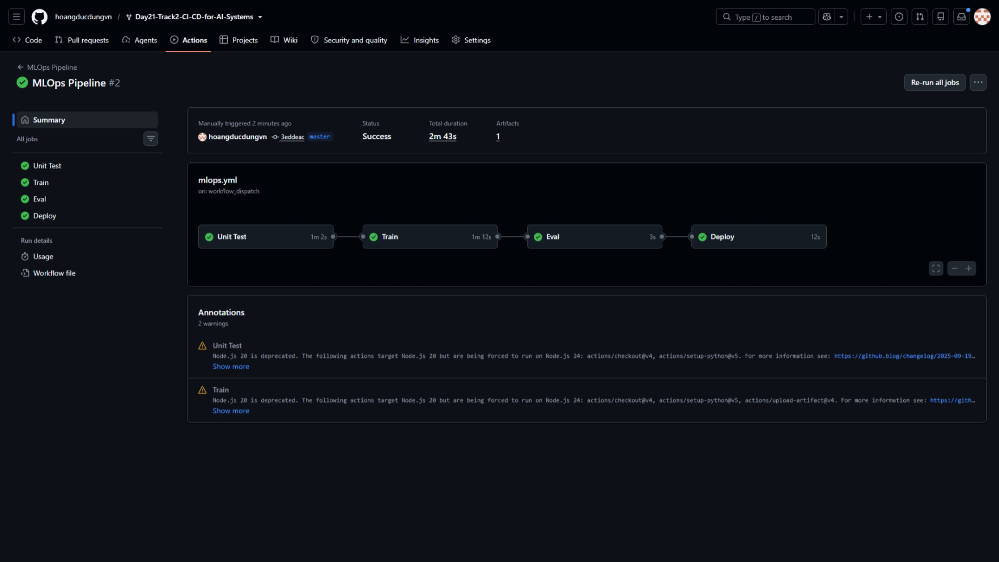
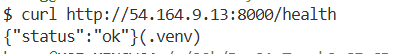
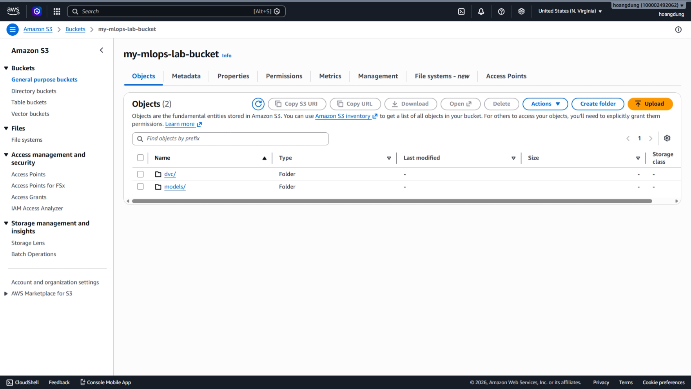

# BÁO CÁO THỰC HÀNH: CI/CD CHO HỆ THỐNG AI (MLOps)

## 1. Bộ siêu tham số (Hyperparameters) đã chọn ở Bước 1
Thông qua quá trình chạy thử nghiệm và theo dõi trên giao diện MLflow, em đã lựa chọn cấu hình siêu tham số sau cho thuật toán Random Forest Classifier:
* `n_estimators`: 300
* `max_depth`: null (không giới hạn)
* `min_samples_split`: 2

*Lý do lựa chọn:* Với cấu hình này, độ chính xác (accuracy) của mô hình đạt trạng thái tối ưu nhất trên tập dữ liệu kiểm thử (đạt 0.682). Số lượng cây quyết định (300) đủ lớn để mô hình có tính ổn định cao và chống được hiện tượng quá khớp (overfitting), trong khi `max_depth=null` giúp mô hình học được các đặc trưng phi tuyến tính phức tạp của bộ dữ liệu phân loại rượu vang.

## 2. Khó khăn gặp phải và Cách giải quyết trong quá trình thực hành

**Khó khăn 1: Chuyển đổi nền tảng Cloud từ GCP sang AWS**
* *Vấn đề:* Bài lab gốc được thiết kế cho Google Cloud Platform (sử dụng GCS), nhưng môi trường thực hành của em sử dụng AWS (S3 và EC2).
* *Cách giải quyết:* Em đã chủ động cấu hình lại mã nguồn để tương thích hoàn toàn với AWS. Cụ thể: 
  - Đổi thư viện DVC remote trong file `requirements.txt` từ `dvc[gs]` sang `dvc[s3]`.
  - Thay thế thư viện `google-cloud-storage` bằng `boto3` và viết lại logic tải file mô hình (`model.pkl`) từ AWS S3 trong file `src/serve.py`.

**Khó khăn 2: Lỗi Pipeline Github Actions khi Huấn luyện liên tục (Continuous Training)**
* *Vấn đề:* Ở Bước 3, khi đẩy thêm dữ liệu mới lên (làm kích thước file mô hình lớn hơn), job Deploy trên GitHub Actions bị lỗi (Exit code 1). Nguyên nhân do lệnh khởi động API (`systemctl restart`) mất nhiều hơn 5 giây để tải mô hình lớn từ S3 về máy ảo EC2, nhưng workflow lại chỉ chờ mặc định 5 giây (`sleep 5`).
* *Cách giải quyết:* Em đã sửa đổi file luồng `.github/workflows/mlops.yml`, thay thế lệnh `sleep 5` cứng nhắc bằng một vòng lặp kiểm tra sức khoẻ API (health check retry-loop) thông minh. Vòng lặp này sẽ gọi ping API liên tục mỗi giây (tối đa 30 giây), giúp hệ thống tự động nhận biết khi nào API thực sự khởi động xong mà không lo bị timeout.

**Khó khăn 3: Quản lý bối cảnh môi trường dòng lệnh (Terminal Context)**
* *Vấn đề:* Đôi khi xảy ra nhầm lẫn giữa việc thực thi các lệnh quản lý mã nguồn Git trên máy cục bộ (Windows) và các lệnh quản trị máy chủ (sudo) trên máy ảo EC2.
* *Cách giải quyết:* Phân tách rõ ràng luồng công việc: máy cá nhân (Windows Git Bash) chỉ dùng để tạo môi trường ảo, theo dõi phiên bản bằng DVC/Git và đẩy code; trong khi máy chủ EC2 (thông qua SSH) chỉ thuần tuý dùng để cấu hình systemd service và chạy môi trường API.

---

## 3. Ảnh minh chứng

### Bằng chứng 4 bước tự động hóa thành công (Github Actions)

### Bằng chứng API hoạt động trơn tru (curl API)

### Bằng chứng dữ liệu và mô hình đã được tải lên Cloud Storage (AWS S3)

